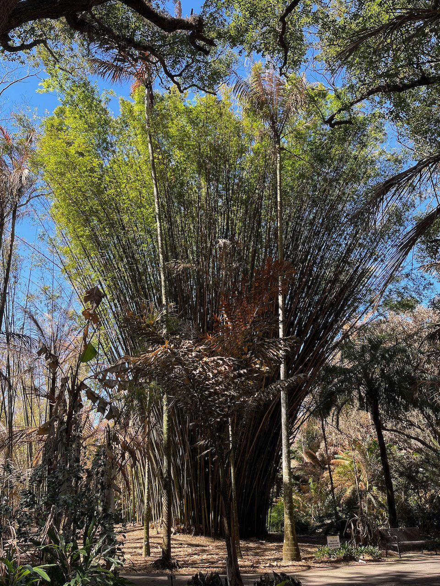
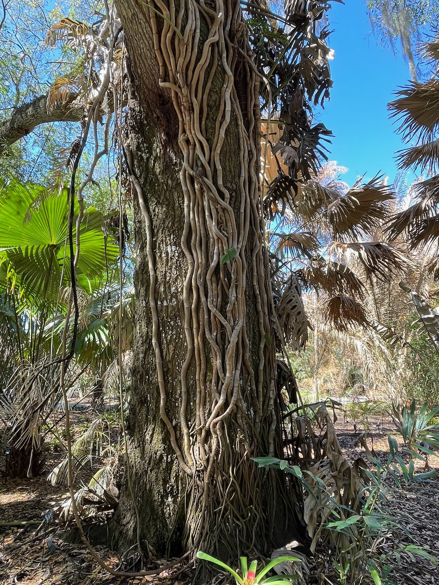
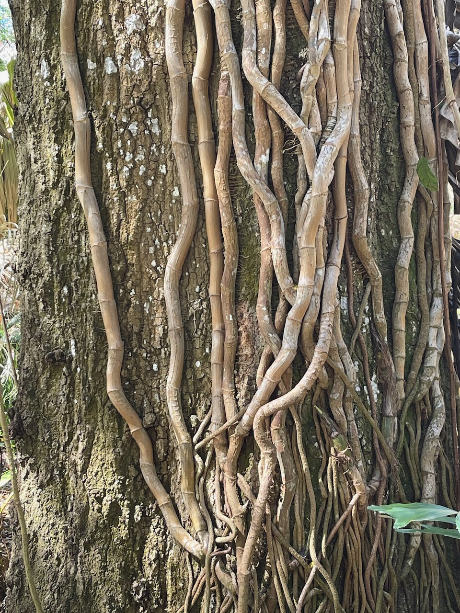
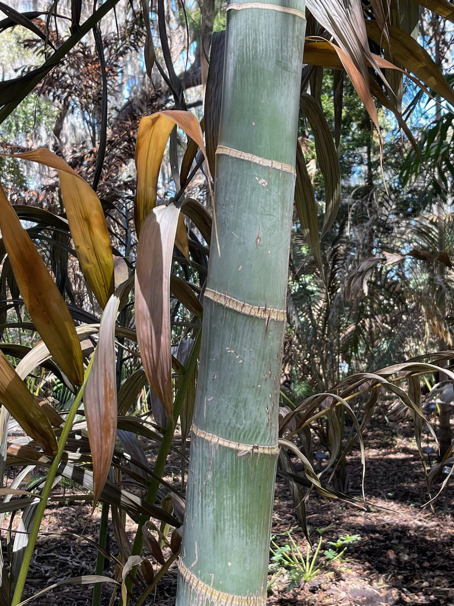
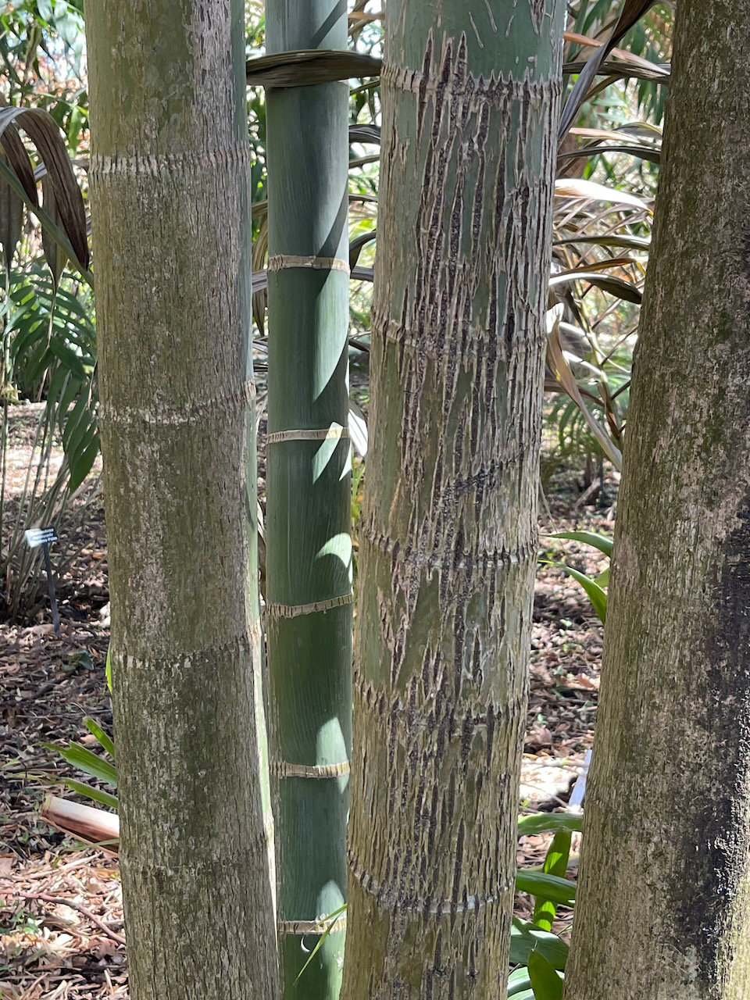
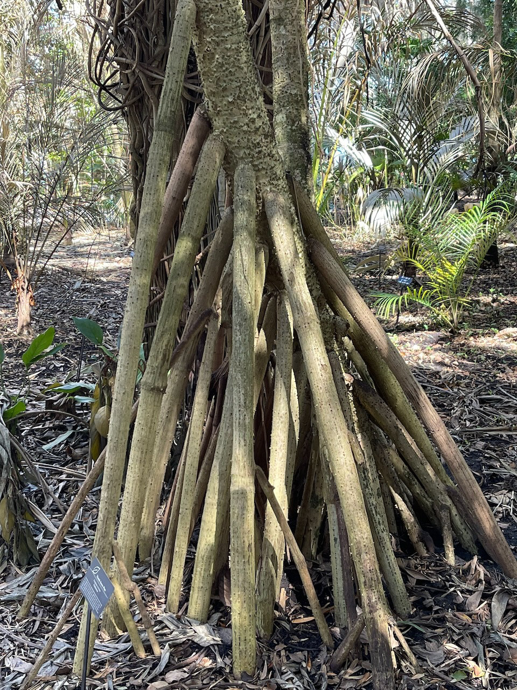
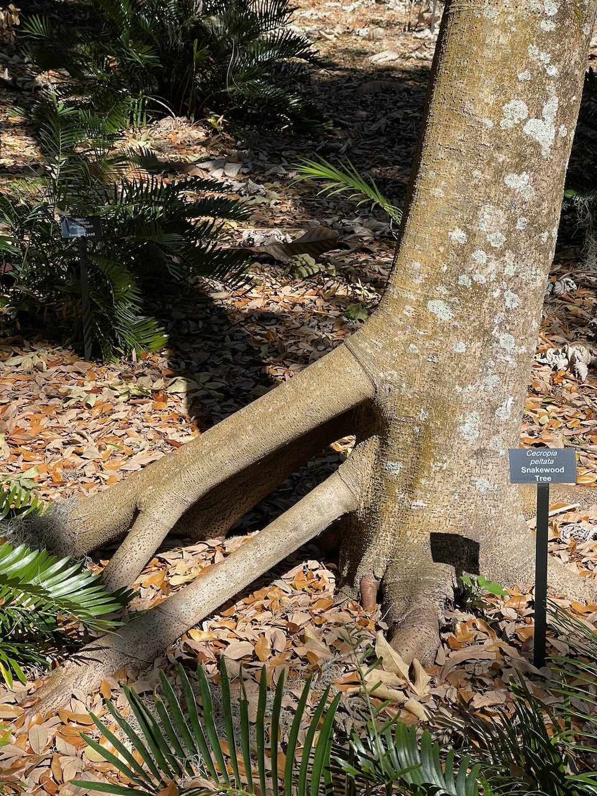
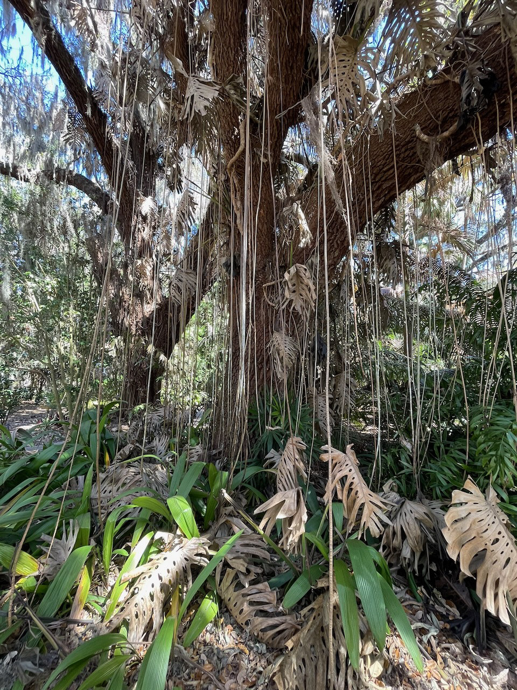
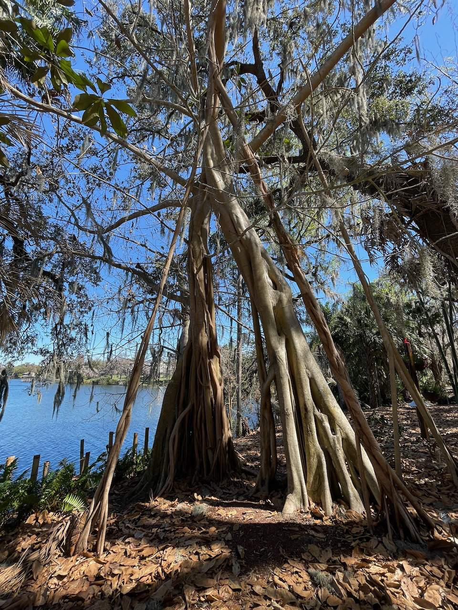
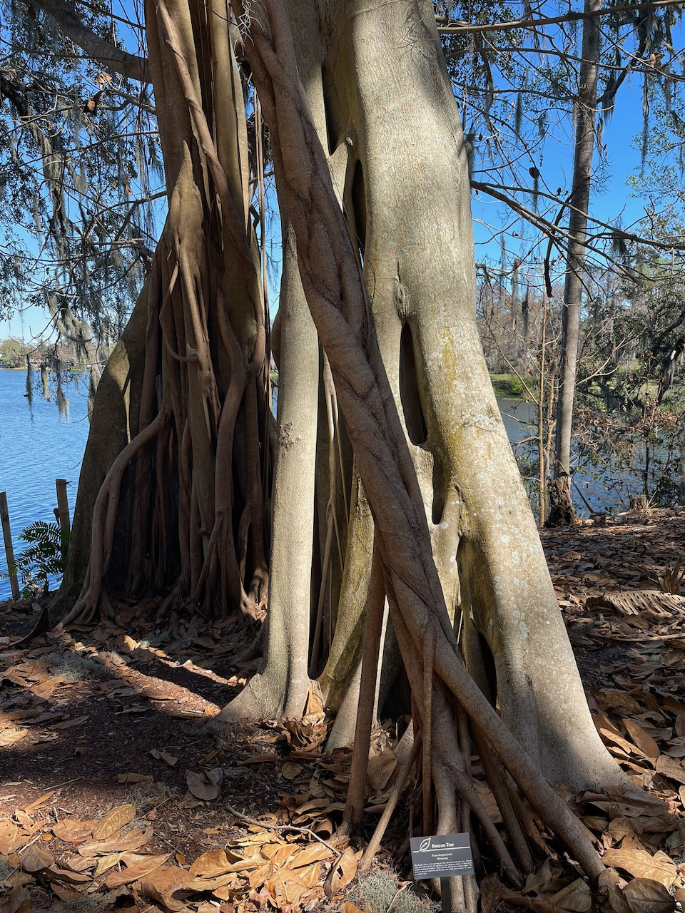

I had a late afternoon flight out of Orlando after Florida DrupalCamp and on the recommendation of AmyJune Hineline, decided to visit Harry P Leu Gardens. As I strolled through the scenic pathways, noting signs about the recent freeze and damage to the plants, I couldn't help but see Git version control workflows everywhere.

### When Silo-Driven Development Gets Out of Hand

Some say the lead developer is still working on The Great Merge Conflict of 2017.

### Git submodules, visualized

It's totally clear to me what is happening here.

### `git log --graph --all --decorate --stat -p`

What **is** going on here anyway?

### The only branch where CI/CD is passing

"All checks passed."

### "Bypass required status checks"

The other branches have been bypassing required status checks since (you guessed it) The Great Merge Conflict of 2017.

### The Great Migration Sprints of 2022

And somehow...it works.

### The hotfix that became LTS

Ok, it was 2 hotfixes, but don't tell the suits.

### 847 Dependabot PRs are ready to be merged

Would you like to review them?

### Scope Creep of a Migration Project

The migration was 80% complete for 5 years, survived 3 rounds of layoffs, and an acquisition announcement mid-sprint on a ironically sunny Tuesday afternoon.

### ...And a Brand Refresh

It **totally makes sense** to add the brand refresh (and site redesign obvs) to the migration project.

Yes, totally.

## About the author/photographer

Hi! My name is Amber Matz and I'm Developer Advocate for [Tugboat](https://www.tugboatqa.com/). All photos were taken by me at Harry P Leu Gardens on February 23, 2026. You are free to share them on social media and caption them yourself, but please give me credit.
